# Docker Disposable Staging Repository Plan

## Decision

Use a dedicated GHCR repository for all disposable Docker build artifacts:

```text
ghcr.io/<owner>/sambee-staging
```

Keep the published candidate repository unchanged:

```text
ghcr.io/<owner>/sambee
```

The staging repository is an isolated transport and validation area. The final repository contains only artifacts that have passed the candidate verification policy. Do not try to delete one staging tag from a package version that also carries final aliases: GHCR package versions are digest-scoped, so deleting that version removes every alias for the digest.

## Goals

- Preserve `ghcr.io/<owner>/sambee:build-vX.Y.Z` as the Docker publication commit point.
- Allow every staging package version to be deleted without affecting a published candidate.
- Retain the existing digest-pinned metadata, signature, and provenance checks.
- Keep retry behavior: a failed pre-publication build may retry with the same version and source.
- Avoid exposing `build-vX.Y.Z`, `sha-<source-sha>`, exact version, or channel tags until the candidate has passed its required checks.
- Do not create a component-specific Git tag or change the shared `build-vX.Y.Z` source registry semantics.

## Repository Layout

| Purpose | Repository | Retention | Consumers |
|---|---|---|---|
| Disposable platform manifests, assembled indexes, and temporary run tags | `ghcr.io/<owner>/sambee-staging` | Short, automatic | Candidate workflow only |
| Published multi-platform candidate and immutable/mutable aliases | `ghcr.io/<owner>/sambee` | Release policy | Operators, deployments, promotion workflows |
| Metadata bundles and Cosign signatures | `ghcr.io/<owner>/sambee-signatures` | Tied to retained final image digests | Candidate verifier and promotion workflows |

The staging repository must never receive `build-vX.Y.Z`, exact version, `sha-<source-sha>`, `test`, `beta`, `stable`, or minor-series tags.

Use only these staging tags:

```text
stage-<run-id>-<attempt>-amd64
stage-<run-id>-<attempt>-arm64
stage-<run-id>-<attempt>-index
```

The index tag is the staging workflow's hand-off reference. Platform tags are optional if Buildx cannot expose the digest-only pushes in a way that lets the index assembly step resolve them. Every tag must identify one workflow run attempt and must be treated as disposable.

## Candidate Flow

```mermaid
flowchart LR
  A[Reserve canonical Git build-vX.Y.Z source tag] --> B[Build and validate native platform images]
  B --> C[Push platform manifests to sambee-staging]
  C --> D[Assemble and verify staging index]
  D --> E[Generate and verify candidate metadata and signature]
  E --> F[Copy verified multi-arch image by digest to sambee:build-vX.Y.Z]
  F --> G[Verify final repository digest and metadata/signature contract]
  G --> H[Create sha and exact-version aliases]
  H --> I[Move test channel]
   I --> J[Delete staging package versions or empty package]
```



### 1. Reserve the source identity

Keep the existing early `prepare_release_candidate.py` reservation behavior:

- Require a `main` dispatch and use the captured dispatch SHA.
- Create or resolve annotated Git `build-vX.Y.Z` before expensive work.
- Reject a version already bound to a different source SHA.
- Keep the tag after a failed Docker build.

This tag is a shared source registry for Docker and Companion. It is not a statement that a Docker image has been published.

### 2. Build and validate in staging

- Point platform Buildx `outputs` at `sambee-staging`, not `sambee`.
- Preserve native smoke tests and Trivy checks against staging repository digests.
- Assemble the multi-platform index in `sambee-staging` using only the platform digests from the current run.
- Verify index media type, platform set, OCI labels, annotations, build tag, source SHA, version, and source URL against the staging index digest.
- Record the staging index digest as the only candidate digest carried between jobs.

A retry after a failure before final publication must start a new staging run. It may leave prior staging artifacts to automated retention; it must not reuse a staging digest unless its provenance and complete metadata are explicitly reverified.

### 3. Construct final-identity metadata before publication

The metadata bundle must bind the final image identity:

```text
image_repository = ghcr.io/<owner>/sambee
image_digest     = <verified staging index digest>
```

The metadata builder currently reads the remote index using the same reference it stores in `metadata.json`. Refactor it to accept two explicit identities:

```text
--inspect-image-ref ghcr.io/<owner>/sambee-staging@sha256:...
--subject-image-ref ghcr.io/<owner>/sambee@sha256:...
```

The builder must read and validate platform descriptors only from `--inspect-image-ref`, while writing `--subject-image-ref` to `metadata.json`. It must verify that both references use the same digest. The bundle verifier for the published candidate continues to require the final `sambee` subject identity.

Publish the digest-keyed bundle to `sambee-signatures` before the final image marker exists. This is permissible intermediate state because the bundle is digest-keyed, validated, idempotent, and has no final image alias.

### 4. Sign and verify the staged digest

This phase required a controlled GHCR proof before production rollout. The proof established that a signature made for the staging image digest verifies under the existing final-image policy after the same digest is copied to `sambee`; Cosign's legacy signature verification is digest-based in this configuration and did not enforce the staging repository name.

Required proof matrix:

1. Build a two-platform staging image index.
2. Copy it to a temporary final repository/tag with `crane cp` or the selected copying tool.
3. Confirm top-level index digest and every runnable child-manifest digest match exactly.
4. Generate a final-identity metadata bundle from the staging inspection reference; verify it against the copied final image reference.
5. Sign `sambee-staging@<digest>` with the dedicated signature repository, then verify `sambee@<digest>` using the required workflow identity and issuer.
6. Inspect the signature payload and Cosign behavior to determine whether repository identity is enforced in addition to digest.
7. Delete the temporary staging package version and confirm the copied final image remains intact.

Sign and verify while the image is still staging-only. The completed proof removed the need for a separate final-candidate repository: the dedicated signature repository and required workflow identity/issuer policy remained valid after the cross-repository digest hand-off.

### 5. Publish the final marker

After staging index, metadata, and signature verification all succeed:

- Recheck that `ghcr.io/<owner>/sambee:build-vX.Y.Z` is absent while holding `docker-release-publication`.
- Copy the complete multi-platform staging index to `ghcr.io/<owner>/sambee:build-vX.Y.Z` by digest. The chosen tool must copy all child manifests and blobs, not only the top-level index.
- Resolve the final marker and require the expected index digest.
- Verify the final index's platform descriptors match the staging index exactly.
- Run `verify_published_candidate_image.sh` against the final repository digest, final-identity metadata bundle, and required signature policy.
- Only after that verification, create/verify `sha-<source-sha>` and exact `X.Y.Z`, then move `test`.

If final copy or post-copy verification fails, fail closed. The marker must never be overwritten. Investigate the final registry state; do not repoint it from a later staging run.

### 6. Remove staging artifacts

After successful final publication, delete the staging package versions for the current run through the GitHub Packages REST API. This is safe because the staging repository has no final aliases. GHCR does not allow deleting a package's last tagged version through the version endpoint. When the current run owns every remaining staging version, delete the whole staging package through the package endpoint instead.

The cleanup helper must:

- List versions only in `sambee-staging`.
- Delete only versions whose complete tag set matches the current run's `stage-<run>-<attempt>-*` pattern.
- Refuse versions with any unexpected tag.
- Before deleting the whole package, require every remaining version and tag to belong to the current run; otherwise leave the last version for a later cleanup attempt.
- Use the package endpoint only for that exclusive-last-version case, and treat an already-absent package as successful cleanup.
- Be idempotent when versions are already absent.
- Emit package version IDs, tags, and deletion result to the Actions summary.

Scheduled retention must delete stale staging versions older than a conservative period, initially seven days. It must protect staging versions from currently running workflow runs only if the Packages API exposes enough information to identify them; otherwise use age plus run-attempt tags and leave the active run to perform immediate cleanup.

Do not use `crane delete` as the authoritative staging cleanup operation. The Packages API deletes GHCR package versions consistently; isolation makes that whole-version deletion safe.

## CI Runtime and Complexity

### Runtime

This design does not reduce image-build runtime. Native platform builds, smoke tests, Trivy scans, SBOM/provenance extraction, and final candidate verification remain required.

Expected runtime effects:

- Add one registry-to-registry multi-platform copy at finalization. This may be a manifest/blob mount operation within GHCR and is expected to be much cheaper than rebuilding, but must be measured.
- Remove the failed cleanup/retry loop and one problematic final-repository deletion job.
- Allow staging cleanup to run independently and predictably after publication.
- Preserve Buildx cache scopes; cache reuse is unaffected by the image repository change.

The likely result is similar wall-clock time with a small final-copy cost, but substantially fewer operator interventions and failed CI reruns. Treat the copy cost as an acceptance metric, not an assumption.

### Complexity

Repository separation simplifies lifecycle ownership:

- Final repository: immutable published candidates and aliases only.
- Staging repository: disposable objects only.
- Cleanup: whole-version deletion is safe and simple.

It adds one deliberate cross-repository transfer and makes metadata/signature repository identity explicit. That is acceptable only if the proof-of-concept demonstrates an unambiguous, digest-preserving, policy-verifiable transfer.

## Git Reservation Timing

### Recommendation: retain early reservation

Do not defer annotated Git `build-vX.Y.Z` reservation until staging succeeds.

Early reservation provides three properties that staging success cannot replace:

1. It atomically binds the committed version to one source SHA before expensive work.
2. It prevents two different `main` commits with the same `VERSION` from both performing expensive builds and colliding only at final publication.
3. It allows the Docker and Companion workflows to select the same canonical source independently, including after `main` advances.

The tag does not expose a Docker image, move a channel, or create a public release. A failed build leaves a source reservation only, which is intentional and cheaper than an ambiguous artifact identity.

### Is late reservation possible?

Yes, technically. The workflow could validate the source, build and verify staging artifacts, then try to create `build-vX.Y.Z` immediately before the final copy. If tag creation loses a race to a different SHA, it must discard the successful staging candidate and fail.

That approach is not recommended because it:

- Defers version-collision detection until after the most expensive jobs.
- Prevents an independent Companion workflow from selecting the canonical source before Docker completes.
- Turns a cheap Git conflict into wasted multi-platform build time.
- Changes the canonical tag from a source registry into a Docker-success-dependent marker, contradicting the shared Docker/Companion design.

If the only concern is permanent tags after failed Docker work, retain the early source tag and document the distinction: `build-vX.Y.Z` in Git reserves source identity; `ghcr.io/<owner>/sambee:build-vX.Y.Z` signals a completed Docker candidate.

## Workflow and Script Changes

1. Add repository outputs in Docker `prepare`:
   - `staging_image_name=ghcr.io/<owner>/sambee-staging`
   - existing `image_name=ghcr.io/<owner>/sambee`
2. Route Buildx platform digest pushes and index assembly to `staging_image_name`.
3. Add a digest-equivalence verifier that compares final and staging index media type, top-level digest, runnable platform descriptors, and required OCI metadata.
4. Refactor metadata construction to separate inspected registry reference from final subject identity.
5. Add a cross-repository promotion helper, distinct from same-repository tag copying. It must require:
   - staging and final image references by digest;
   - an absent final immutable marker;
   - post-copy digest/platform verification;
   - no mutable aliases.
6. Make signature behavior explicit after the proof-of-concept. Do not infer cross-repository validity from a matching digest.
7. Replace the current cleanup job with an isolated staging-repository package-version cleanup helper.
8. Update all candidate summaries with staging repository, staging digest, final digest, copy result, and cleanup result. Do not show staging references in public-facing release documentation.
9. Update release docs and the lockstep plan only after the proof-of-concept succeeds.

## Test Plan

### Completed GHCR transfer proof

On 2026-07-28, the guarded `verify-ghcr-staging-transfer.yml` workflow completed successfully against GHCR using disposable, per-run package repositories.

- Staging and final index digest: `sha256:ee6521f290b2168b6e0935a181d4cff9be1ac3f505666ef0e3c98fae8199917a`.
- `crane cp --no-clobber` preserved the top-level index digest and all runnable platform descriptors across repositories.
- A Cosign signature for the staging digest, stored in the dedicated disposable signature repository, verified against the final repository digest under the workflow's GitHub Actions identity and issuer policy.
- Deleting the isolated staging package did not change or remove the final package.
- The proof cleanup removed the remaining disposable staging, final, and signature packages.
- GHCR rejected an attempt to delete a package's last tagged version through the version endpoint; deleting the uniquely named disposable package through the package endpoint succeeded.

This proves the cross-repository copy, signature-verification, and package-isolation assumptions required for the staging design. It does not replace the production candidate workflow tests below, including final-identity metadata construction, retry behavior, failure recovery, and measured release-CI overhead.

### Unit and static tests

- Staging and final repository names are distinct and derived from the same lowercase owner.
- Platform Buildx outputs target staging only.
- No staging tag is created in `sambee`.
- Final `build-vX.Y.Z` marker is created only after staging verification, metadata publication, and signature verification jobs.
- Cross-repository promotion rejects a missing staging digest, mismatched digest, existing conflicting final marker, changed platform descriptor, or missing required OCI label.
- Metadata construction records final image identity while validating the staging inspection index.
- Final verifier rejects metadata that names staging as the published image repository.
- Cleanup only addresses `sambee-staging`; it refuses any version with tags outside the current run pattern and deletes a last version only by safely deleting an exclusively owned package.
- A failed staging build leaves no final image marker, source-SHA alias, exact version, or channel mutation.
- A retry with the same early Git reservation builds a new staging attempt and can publish the final marker.

### Controlled GHCR validation

Use a new disposable version and run these in order:

1. Build both platforms into `sambee-staging`; verify no `sambee` candidate marker exists.
2. Assemble and verify a staging index; inspect GHCR package versions and tags.
3. Generate final-identity metadata and prove it verifies against a copied final test image.
4. Run the Cosign cross-repository proof matrix.
5. Copy a verified index to the final build marker; require digest and child descriptors to match.
6. Verify final metadata/signature contract, then create source-SHA/exact-version/test aliases.
7. Delete the staging package version and verify final aliases still resolve.
8. Deliberately fail before final copy; retry with the same source/version and verify the final marker remains absent until the successful retry.
9. Deliberately fail after final copy but before alias promotion; verify repair-only behavior restores aliases without rebuilding or changing the marker.
10. Measure staging build, final copy, cleanup, and total workflow durations against the current workflow.

## Rollout Criteria

Do not enable the design until all of the following are true:

- Cross-repository multi-platform copying preserves the top-level and child digests.
- Metadata can bind the final repository identity while its inspected content is staging-only.
- Cosign's verified identity policy remains valid after the repository hand-off, or a replacement policy/repository boundary has been explicitly proven.
- Staging cleanup deletes only staging package versions and cannot affect final repository versions.
- A pre-publication failure remains retryable with the same Git source reservation and no final marker.
- Final marker assignment remains after all required checks and before final aliases.
- The measured copy overhead is acceptable for release CI.
