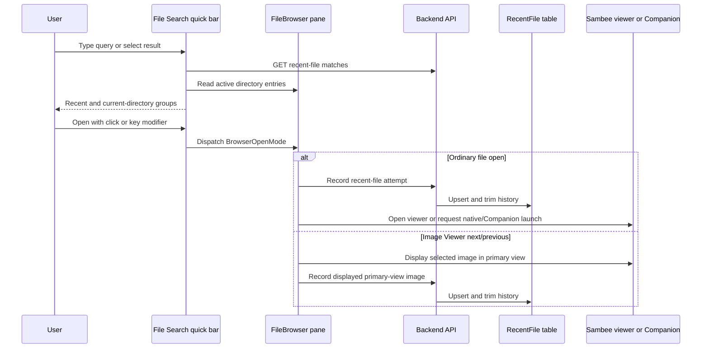

# File Search Implementation Plan

## Status

Implementation-ready plan. This document defines the implementation plan for replacing the quick-bar current-directory filter with File Search. It is not end-user documentation.

## Objective

Provide a fast file-opening workflow without globally indexing files. File Search combines, for the authenticated user:

1. Recently opened regular files across connections and directories.
2. Regular files in the active pane's current directory.

The feature replaces the existing Filter quick-bar mode. It must preserve all existing file-opening choices, operate safely with changed connection access, and keep the recent-file history bounded and per-user.

## Confirmed Product Decisions

| Area | Decision |
| --- | --- |
| Activation | Replace `Ctrl+Alt+F` with bare `/` and rename the mode from `Filter` to `File search`. |
| Search scope | Do not build a global file index. Search only retained recent files and the active pane's loaded current-directory listing. |
| Result groups | Display recent files first, then current-directory files. Each group returns at most the configured result limit, initially 10. |
| History ownership | Persist recent files per authenticated user in a dedicated backend table. |
| Recording semantics | Record a file when the browser initiates an open attempt, including a Companion/native launch request. Do not add a Companion callback API or claim that an external native app confirmed success. |
| Viewer navigation | Record a file only when it is displayed in Image Viewer's primary view. Record every distinct main-view file reached through next/previous navigation; thumbnails and preloads do not count. |
| History maintenance | `Shift+Delete` removes the selected recent-file result only. File Browser settings offer a user action to clear all of that user's recent history. |
| Administrator policy | Add a database-backed File Search administrator settings category. The retained-history range is 0-500 (default 50); the per-group result-limit range is 1-50 (default 10). |
| Exclusions | Support image and temporary/backup categories, both excluded by default, plus excluded extensions. A file is excluded when it matches either an enabled category or an excluded extension. |
| Temporary/backup matcher | Match case-insensitively: names beginning `~$` or `.#`; names ending `~`; and extensions `.bak`, `.tmp`, `.temp`, `.swp`, `.swo`, `.swx`, `.old`, `.orig`, `.rej`, `.part`, and `.crdownload`. Do not classify broad extensions such as `.lock` or `.cache` as temporary/backup. |
| Hidden files | Current-directory results include exactly the files shown by the ordinary current file listing. |
| Query scope and ranking | Only a file name participates in search matching; parent paths and connection names are display-only metadata. Match case- and diacritic-insensitively with exact, prefix, word-boundary-prefix, then substring ranking. Do not implement fuzzy subsequence matching in the first release. |
| Cross-directory selection | Selecting a recent result opens its stored target directly without changing the active pane's connection or directory. |
| Policy updates | Retention and exclusion policy changes affect only future recording, except lowering retention trims rows and setting retention to zero clears history. Existing excluded records remain searchable until naturally removed, trimmed, or cleared. |
| Extension input | Accept literal file extensions only, with no hard maximum count. Glob patterns are not supported. Validate a named maximum individual extension length and overall policy request-body size. |
| Open failures | Remove records after a non-transient open failure, using stable machine-readable error codes. Preserve records after cancellation, network/timeout, rate-limit, and server failures. Preserve local-drive records when Companion is unavailable, unpaired, or awaiting pairing approval; remove them when Companion's file listing confirms the file is absent. |
| Cross-tab synchronization | Use a dedicated recent-files `BroadcastChannel` plus a same-tab custom event. Refresh recent results on those events and when a tab returns to visible/focused state. |
| Audit | No feature-specific audit trail is required beyond operational logging. |

"Recently opened" therefore means "a browser-initiated Sambee open attempt," not "the native application successfully displayed the file."

## Existing Implementation Anchors

The implementation should extend these established paths rather than create parallel behavior:

- `frontend/src/pages/FileBrowser.tsx` owns quick-bar mode selection, shortcuts, active-pane selection, and search-provider routing.
- `frontend/src/components/FileBrowser/UnifiedSearchBar.tsx` owns result keyboard navigation and selection dispatch. Its current provider contract only passes a result value, so it cannot preserve selection modifiers without a small contract extension.
- `frontend/src/pages/FileBrowser/useFileBrowserPane.ts` owns the existing open modes, native/Companion launch, browser-viewer picker, and Image Viewer navigation. `handleViewIndexChange` is the required recording hook for gallery next/previous navigation.
- `frontend/src/components/FileBrowser/search/` already contains provider implementations and result-row patterns. Add a dedicated File Search provider there; remove the filter-specific provider from active use.
- `backend/app/db/migrations.py` provides ordered, forward-only schema migrations.
- `backend/app/models/user_settings.py` and `backend/app/services/user_settings.py` provide the user-settings API used for the clear-history action's surrounding File Browser page, but the recent-file records themselves must not be stored as a user-setting blob.
- `backend/app/api/system_settings.py`, `backend/app/models/system_settings.py`, and `backend/app/services/system_settings.py` provide the administrator settings API pattern. The present generic definition is integer-focused, so File Search exclusions require a typed policy model rather than an unvalidated string workaround.
- `frontend/src/components/Settings/settingsNavigation.ts` and `frontend/src/components/Settings/SettingsCategoryContent.tsx` own settings category registration and rendering.

## Target Architecture

For ordinary user-initiated opens, the event recording call occurs immediately before the browser launches the selected viewer, native app, or Companion URI. For Image Viewer next/previous transitions, it occurs only after the primary view commits to the new image. Both are best-effort authenticated browser operations: a recording failure must be logged and surfaced only as a non-blocking failure; it must not prevent an otherwise valid file open or gallery transition. The open flow remains authoritative for access checks and viewer/native launch errors.

## Data Model and Migration

### `RecentFile` model

Add `backend/app/models/recent_file.py` and import it from `backend/app/db/database.py` before metadata creation. The table should contain:

- `id`: UUID primary key.
- `user_id`: required foreign key to `user.id`, indexed.
- `connection_id`: required foreign key/reference to the connection identity used to reopen the file, indexed as appropriate for the existing connection model.
- `path`: normalized relative path within the connection, never an absolute local filesystem path.
- `file_name`: final path component, stored for display and efficient simple matching.
- `last_opened_at`: UTC timestamp used for ordering and retention trimming.
- `created_at`: UTC timestamp for diagnostics and future UI needs.

Enforce one record per `(user_id, connection_id, path)`. Add an index supporting `user_id` plus descending recency. Keep the path as the canonical identity; `file_name` is denormalized display/search metadata and must be updated by the upsert.

### Migration

1. Add the next numbered migration in `backend/app/db/migrations.py`.
2. Create the table, uniqueness constraint, and indexes with portable SQL compatible with supported database dialects.
3. Do not backfill: this is new, per-user behavioral history.
4. Confirm a fresh database receives the table from `SQLModel.metadata.create_all` and an existing database receives it from the migration sequence.

### Path normalization and validation

Centralize normalization in a backend helper/service. It must:

- reject empty paths, root-only paths, absolute paths, `.` and `..` traversal, and directory entries;
- use the same slash convention used by browser API paths;
- keep connection identity separate from the path;
- use a filename derived from the normalized path, not client-supplied display data;
- verify the user can access the target connection before recording, searching, removing, or opening through the recent-file route.

Do not resolve every path against storage while searching. Existence and authorization must be rechecked by the usual browser/file-open path when the user selects an item. Selecting a recent result opens it directly and does not navigate the active pane. When an open fails, remove the record unless the failure is classified as transient. A missing/unpaired Companion must preserve a local-drive record; remove it only when the Companion file listing definitively confirms that the path is absent.

## Backend API and Service Plan

### Service boundary

Add `backend/app/services/recent_files.py` as the single owner of:

- policy retrieval and exclusion evaluation;
- normalized-path validation;
- record/upsert and immediate retention trimming;
- recent-result matching and ordering;
- single-record removal;
- clear-all history for the current user;
- stale-record removal according to stable, named open-failure codes;
- filename query normalization, matching, and ranking shared through documented test vectors.

Use named constants for default values, validation bounds, result caps, policy identifiers, and supported exclusion categories. No frontend client may decide whether a file qualifies for history; this must be a backend policy decision.

### Endpoints

Add authenticated endpoints under the existing browser-oriented API router, subject to the current user and connection-access dependencies. Exact route names can follow local router conventions, but the API must provide:

| Operation | Required request/response behavior |
| --- | --- |
| Record attempt | Accept connection ID and relative file path. Validate access, verify the target is a regular file according to the browser's known open intent or authoritative backend check, apply exclusions, upsert, and trim. Return no sensitive metadata beyond the recorded result when needed by the caller. |
| Search recent files | Accept query and a bounded limit. Match the authenticated user's retained records, return most-recent-first results with connection/path context, and cap server output before sending it to the browser. |
| Remove one | Accept a recent-record ID. Delete only a row owned by the authenticated user. Treat a missing/foreign record as a non-enumerating not-found response. |
| Clear all | Delete all rows owned by the authenticated user. Return a count or success response suitable for refreshing the File Browser settings UI. |

The server must clamp all client-provided result limits to a named maximum. Search matches only the filename; paths and connection names never participate in matching. Normalize a query and filename by Unicode NFKD normalization, removing combining marks, and case folding. Rank matches in this order: exact filename; filename prefix; prefix at the start of a word after a non-alphanumeric separator; then general substring. For recent-file ties, use `last_opened_at` descending; for current-directory ties, retain the active file-list sort order. Do not implement fuzzy subsequence matching in the first release. Keep shared backend/frontend test vectors for accented names, separators, and every ranking tier. With a retained history in the tens or low hundreds, no full-text index is needed.

### Upsert and retention behavior

For every eligible record attempt:

1. Normalize and authorize the connection/path.
2. Evaluate the current administrator exclusion policy.
3. Insert the record or update its `file_name` and `last_opened_at`.
4. Remove the oldest rows for that user until their total is at or below the configured retention limit.
5. Commit atomically.

Reopening a file moves it to the top. Lowering retention must trim existing history when the policy is saved, and the service must still trim defensively on every later upsert. A retention value of zero disables history: saving that value clears all existing recent-file records, search returns no recent-file results, and future open attempts do not create records.

### Administrator File Search policy

Add a typed `FileSearchSettingsRead` / `FileSearchSettingsUpdate` model and a dedicated `/api/admin/settings/file-search` GET/PUT surface. The policy should include:

- recent-file retention count, range 0-500 and default 50;
- per-search-group result limit, range 1-50 and default 10;
- exclusion category set, with `images` and `temporary_backup` initially supported and enabled by default;
- normalized, de-duplicated excluded extension set.

Persist the policy only through the existing database-backed `SystemSetting` store. The feature does not read `config.toml`, add config allowlist entries, or expose configuration-file source/reset semantics. Because the generic integer setting definitions cannot safely represent sets, use a specific typed File Search policy serializer/parser with strict Pydantic validation and stable JSON encoding. Do not accept arbitrary unvalidated JSON from the frontend.

Extension and category exclusions combine with OR semantics: a file is not recorded when either matches. Normalize literal extensions by trimming whitespace, lowercasing, and accepting either `.ext` or `ext` input before storing canonical leading-dot values. Do not support glob patterns and do not impose a hard count limit on extensions. Enforce named maximums for an individual normalized extension and the full policy request body to prevent pathological input without creating a user-visible count limit. Category recognition must reuse Sambee's existing image-recognition logic and define the temporary/backup matcher centrally; it must not be duplicated in the frontend. The temporary/backup matcher is case-insensitive and matches `~$` and `.#` name prefixes, a trailing `~`, and the approved extension set. Policy changes do not retroactively remove records merely because they now match an exclusion.

### Open-failure classification

Do not infer stale-record behavior from human-readable error text or raw status codes alone. Add stable machine-readable error codes to relevant backend and Companion responses, then centralize their classification in the frontend open flow:

| Classification | Required error conditions | Recent-record action |
| --- | --- | --- |
| Permanent | Target missing, target is no longer a regular file, invalid target path, connection removed, access revoked, or confirmed native-app launch failure | Remove the record. |
| Transient | User cancellation, request cancellation, network/connection failure, timeout, rate limit, or HTTP `5xx` | Preserve the record. |
| Local Companion unavailable | Companion is unreachable, unpaired, or awaiting local pairing approval | Preserve the local-drive record. |
| Local target confirmed missing | A successful Companion file-info/listing check confirms the target path is absent | Remove the local-drive record. |

Use named codes such as `recent_file_target_missing`, `recent_file_target_not_file`, `recent_file_invalid_path`, `recent_file_connection_removed`, `recent_file_access_denied`, and `recent_file_native_launch_failed` for permanent outcomes. Keep network classifications based on the existing Axios cancellation/network/timeout signals. Expand Companion's current broad `400`/`500` errors where needed so the frontend never treats an ambiguous failure as permanent.

### Logging and errors

Log concise, actionable events without exposing file contents or authentication material:

- debug/info: record eligible open attempt, policy exclusion, user-initiated removal, clear operation, retention trim count;
- warning/error: failed record operation with safe connection/path identifiers and error category.

Do not log raw request payloads, file contents, or credentials. Return field-owned validation errors for invalid administrator settings and ordinary actionable user errors for inaccessible or stale selections.

## Frontend Plan

### 1. Replace Filter mode with File Search mode

1. Rename the stable quick-bar mode ID from `filter` to `file-search`, updating `FileBrowser.tsx`, browser command definitions, keyboard shortcuts, provider types, translations, tests, and any mode-specific recovery handling in one coherent change.
2. Bind File Search to `/` through `BROWSER_SHORTCUTS`. It must be enabled only when the file browser has the appropriate focus and no conflicting text editor, dialog, or settings control owns keyboard input.
3. Remove the old behavior that assigns the quick-bar query to `currentDirectoryFilter` and filters the main directory listing. Entering search text must no longer mutate the visible file list.
4. Retire `useCurrentDirectoryFilterProvider` if it becomes unused, together with filter-only translations and tests. The ordinary file listing continues to control which current-directory files File Search sees, including hidden-file behavior.
5. Keep `Ctrl+K` directory navigation and `Ctrl+P` command palette unchanged.

### 2. Build a File Search provider

Add `frontend/src/components/FileBrowser/search/useFileSearchProvider.tsx`. It should receive:

- the active pane's connection ID, current path, loaded `FileEntry[]`, and current connection label;
- a callback that opens an explicit target file using a requested `BrowserOpenMode`;
- a callback that removes a selected recent-file result;
- the API client and translated labels.

For each query, concurrently:

1. Request the capped recent-file matches from the backend, with cancellation support.
2. Filter the active directory's loaded regular-file entries in memory.
3. Exclude any current-directory item whose `(connection_id, path)` is already represented in the recent group.
4. Return a single ordered result list with non-selectable group headers, or extend `SearchResult` with an explicit result kind so headers cannot receive focus or actions.

Recent rows must display filename, connection, and parent path. Current-directory rows must be visibly grouped and indicate their local context. Both groups should appear on an empty query. The provider matches and ranks the query by filename only using the specified normalization and tiers; connection and parent-path text is display-only. Selecting a recent row opens its stored target without navigating the active pane. Use existing result-row typography, icons, virtualization, and loading/error conventions.

### 3. Make result selection action-aware

Extend the `SearchProvider` / `UnifiedSearchBar` selection contract so a result provider receives the action selected by the user, not only its string value. Model this as a typed action rather than leaking DOM events through provider APIs:

| User interaction | Requested action |
| --- | --- |
| Click or Enter | `associated-viewer` |
| Shift+click or Shift+Enter | `force-viewer-picker` |
| Ctrl+click or Ctrl+Enter | `associated-native-app` |
| Ctrl+Alt+click or Ctrl+Alt+Enter | `force-native-picker` |

Implement modifier handling for both pointer and keyboard result selection. Resolve `Ctrl+Alt` before `Ctrl` so the native picker wins. Preserve existing command and directory providers by mapping their selections to their current behavior and ignoring unsupported modifiers.

Add a provider result identity that distinguishes recent-record IDs from current-directory path identities. The provider must open a recent target by its stored connection/path, not by composing the active pane's path or navigating the active pane.

### 4. Support recent-result removal

While a File Search result row is selected and the quick bar owns keyboard focus, `Shift+Delete` must:

1. remove only a selected recent-file result;
2. do nothing for a current-directory result or a group header;
3. call the remove endpoint, refresh search results, and retain quick-bar focus;
4. never invoke the normal file-browser delete-file operation.

Update the quick-bar footer/hint only while a removable recent result is selected. Manual single-result removal is keyboard-only in this release; do not add a pointer-accessible row removal control.

### 5. Record all browser-originated opens

Centralize the record-attempt call in `useFileBrowserPane.ts` immediately before the browser commits to a valid file open. It must cover:

- associated Sambee viewer opens;
- forced Sambee viewer-picker selection after the user confirms a viewer;
- associated native app opens;
- forced native-picker opens;
- Companion URI launch requests;
- a file selected from either File Search group;
- every distinct file displayed in Image Viewer's primary view after next/previous navigation through `handleViewIndexChange`.

Do not record directories, merely focused rows, dismissed viewer pickers, failed preflight validation, an unchanged gallery index, thumbnail/filmstrip selection, or preload/cache activity. For Image Viewer navigation, derive the next file path from `viewInfo.images[index]`, avoid duplicate events for the same current index/path, and record only after the primary viewer has committed to displaying that path. The record action must use the pane's current connection identity and normalized image path.

For direct native and Companion paths, record once the browser has a valid target and immediately before invoking the browser/native launch request. Do not wait for a success callback that does not exist. If a record request fails, proceed with the open and make the error observable through safe logging and a non-blocking UI mechanism.

### 6. Add the settings surfaces

Before editing either surface, follow `website/content/docs/0.9/developer-guide/frontend-architecture/settings-form-dialog-pattern/index.md`.

#### Administrator File Search category

1. Add `admin-file-search` to frontend settings types, routes, category metadata, navigation, descriptions, data cache keys, API methods, and mocks.
2. Add a `FileSearchSettings` page using the established settings page layout and the typed admin API.
3. Validate numeric bounds locally while retaining backend validation as authoritative.
4. Use appropriate controls: numeric inputs/steppers for limits, checkboxes for category exclusions, and a dedicated literal-extension list editor with normalization feedback. Do not use freeform unstructured JSON or accept glob patterns; do not impose an arbitrary extension-count limit.
5. Show database-override versus built-in-default source and provide reset-to-default behavior. Do not show config-file source or reset-to-config behavior.

#### User File Browser category

1. Add a `Clear recent files` destructive action to the existing File Browser settings page.
2. Use `ResponsiveFormDialog` for its confirmation. The action must not be the default Enter action, must have clear user-scoped wording, and must restore focus after completion.
3. On success, invalidate/refresh active File Search results in the current tab and synchronize other tabs through the dedicated recent-file `BroadcastChannel` and same-tab history-changed event.

### 7. Localization and accessibility

Add translations for File Search mode labels, group headings, empty states, result metadata, stale/inaccessible errors, record failures where visible, removal/clear confirmation, policy controls, validation, source/reset labels, and shortcut hints.

Verify that:

- group headers are announced but not selectable;
- result rows have accessible names including disambiguating connection/path data;
- keyboard focus remains visible and stable after removal or opening;
- icon-only controls have accessible labels/tooltips;
- destructive actions have confirmation, Escape cancellation, and no accidental default submission;
- `/` does not hijack normal text editing or dialog inputs.

### 8. Synchronize recent-file changes across tabs

Add a dedicated `sambee-recent-files` `BroadcastChannel` and a same-tab `sambee:recent-files-changed` custom event. Do not reuse the user-settings channel because recent-file rows are separate per-user data, not user settings.

Publish a history-changed message after a successful record, single-result removal, clear operation, retention trim that changes visible results, or policy update that clears history. Active File Search providers invalidate their recent-result request/cache on receipt; when the tab regains focus or becomes visible, they refresh the recent group as a fallback for missed messages or browsers without `BroadcastChannel` support. The local custom event keeps the originating tab in sync because `BroadcastChannel` does not echo to its sender.

## Quick-Bar Result Presentation Amendment

### Goal

Commands, Directory Navigation, and File Search must use one quick-bar result design, owned in one place. Providers may differ in their data, matching, grouping, icons, and selection behavior, but they must not provide their own row markup or visual styling.

The shared presentation should be compact and scan-oriented. Use the current Commands result list as the visual baseline: proportional type, a larger primary line, and a smaller muted secondary line. Apply the best navigation and File Search details only where they are meaningful, while retaining one common layout and visual language:

- one restrained row treatment for every selectable result;
- small, quiet group labels rather than colored section bands;
- primary text first, contextual metadata second;
- semantic icons that distinguish directories, ordinary files, recent files, and commands without changing layout;
- selection, hover, keyboard focus, truncation, highlighting, padding, row heights, and accessible names applied consistently by the shared renderer.

This amendment applies to both desktop and compact/mobile quick bars. It does not change search scope, ranking, provider actions, result ordering, or keyboard modifiers.

### Problem and root cause

`UnifiedSearchBar` is the shared popper/list owner, but `SearchResult.display` is currently an arbitrary `ReactNode`. `useDirectorySearchProvider` embeds its own smart-path typography and highlighting; `useFileSearchProvider` embeds a separate icon plus `ListItemText` design. Consequently, spacing, fonts, metadata presentation, and group treatment are provider-defined instead of component-defined.

The current File Search header rows are also rendered with the same fixed virtual-row estimate as full results. Their shaded backgrounds and 56 px allocation make group boundaries visually dominant. File Search row subtitles additionally repeat group membership (for example, `Recent - Demo:/`) even though the enclosing group already states it.

### Design decisions

1. Keep one `UnifiedSearchBar` popper and virtualized list. Do not create a File Search-specific list or a Directory Navigation-specific renderer.
2. Replace provider-supplied `SearchResult.display: ReactNode` with a discriminated structured presentation model. Providers return data; `UnifiedSearchBar` renders all row DOM and styles.
3. Preserve semantic icons by returning a named icon category, not an icon component or JSX. The shared renderer maps that category to the existing MUI icons.
4. Keep Directory Navigation's useful smart path reduction and match highlighting, but move its visual rendering into a pure shared result-row renderer. The directory provider may calculate visible path text and highlight ranges; it must not emit `Box`, `Typography`, `ListItemIcon`, or `ListItemText` elements. Use the shared proportional typography for directory paths rather than a mode-specific monospace treatment.
5. Render File Search groups only when their group contains results. Render them as compact, non-selectable labels with no filled background. Use spacing and a subtle top divider before subsequent groups; do not use a full-width colored band.
6. File Search subtitles contain context only, in the established rooted browser-path format:
    - recent result: `<connection>:<parent path>`;
    - current-directory result: `<active connection>:<current path>`.

    The path portion must always begin with `/`, including the connection root, for example `Connection:/dir/file.txt` and `Connection:/`. Remove the translated per-item `Recent - ` and `Current directory - ` prefixes. Group labels remain the only origin labels.
7. Keep the History icon for a recent file and the file icon for a current-directory file. This is useful secondary differentiation, but their alignment, size, title style, subtitle style, and vertical rhythm must be identical to directory and command rows.
8. Use explicit shared constants for result-row and group-header heights. The virtualizer must estimate the correct height by result kind, so compact group labels do not reserve full item-row space or create scroll-position errors.
9. Accessible option names continue to include the filename/primary text and contextual subtitle. Group headings remain announced as level-two non-selectable headings. Never expose the removed origin prefixes as hidden duplicate text.

### Implementation steps

1. Refactor `frontend/src/components/FileBrowser/search/types.ts`.
    - Define a discriminated `SearchResult` union such as `SearchResultItem` and `SearchResultGroupHeader`.
    - Replace `display` with structured fields: `primaryText`, optional `secondaryText`, `icon`, and optional primary/secondary highlight ranges.
    - Define named icon categories (`directory`, `file`, `recent-file`, `command`, or the established equivalent) and structured highlight segments/ranges. Do not put MUI components, style objects, or arbitrary React nodes in provider output.
    - Retain stable `id`, `value`, and selection semantics. Group headers remain non-selectable and cannot be removed.

2. Extract the shared presentation layer under `frontend/src/components/FileBrowser/`.
    - Add a focused `QuickBarResultRow` renderer and, if it keeps the shared component clearer, a `QuickBarResultGroupHeader` renderer.
    - Use the current Commands presentation as the shared baseline: proportional type, a larger primary line, and a smaller muted secondary line. Centralize those typography values together with row dimensions, icon column width, horizontal padding, selection colors, hover colors, text truncation, and header spacing in named constants.
    - Use the current design system colors only. Group headers should use muted caption/overline-like text on the popper background, with a restrained divider before a later group. They must not have `action.hover` or another filled band behind them.
    - Make a single icon mapping in this renderer. Reuse the existing folder, file, recent-history, and command icons rather than importing icons in providers.
    - Render highlights with semantic text spans and the existing theme emphasis color/weight. Highlighting must not disrupt truncation or change layout between providers.

3. Update `UnifiedSearchBar.tsx` to consume the typed result model.
    - Replace direct `{result.display}` rendering with the shared item/header renderers.
    - Replace the one-size `RESULT_ROW_HEIGHT` assumption with `getQuickBarResultRowHeight(result)` in the virtualizer's `estimateSize` callback. Use a smaller named group-header height and the existing full item height for selectable rows.
    - Keep keyboard navigation's existing header-skipping behavior, but switch its checks to the discriminated result kind.
    - Maintain `role="listbox"`, `role="option"`, `aria-selected`, and group-heading semantics. Ensure the option's accessible name derives from the shared primary and subtitle text.
    - Preserve the existing dropdown width, maximum viewport height behavior, footer, loading, error, and result-count behavior. Recalculate the list's maximum height using the new row metrics so a group label does not count as a full result row.

4. Convert `useDirectorySearchProvider.tsx` to structured data.
    - Keep directory-cache requests, separator normalization, status text, query behavior, and selection unchanged.
    - Extract the existing `SmartPathDisplay` logic into pure data helpers: normalize/split the path, select the visible primary path, derive the optional parent-path subtitle, and calculate highlight segments for the active query.
    - Return `directory` icon metadata and the derived primary/secondary text to the shared proportional-typography renderer.
    - Delete provider-owned MUI row imports and JSX rendering after the shared renderer supplies the equivalent appearance.

5. Convert `useFileSearchProvider.tsx` to structured data and remove duplicated labels.
    - Replace `ResultRow` and its MUI imports with item data for recent and current-directory files.
    - Return `recent-file` and `file` icon categories, the filename as primary text, and only rooted `<connection>:<parent path>` metadata as the subtitle. Normalize every displayed path to begin with `/`, including root paths.
    - Keep the `Recent files` and `Current directory` group headers, caps, recent-first ordering, deduplication, selection modes, and `Shift+Delete` behavior unchanged.
    - Remove `fileBrowser.search.resultDetails.recent` and `fileBrowser.search.resultDetails.currentDirectory` from all locales once no references remain. Add or reuse a neutral translated metadata format only if localization requires connection/path punctuation to vary by locale; it must not encode origin labels.

6. Convert the browser command and smart-provider adapters.
    - Update `useBrowserCommandsProvider.tsx` and `useSmartBrowserSearchProvider.tsx` for the new structured result union so Commands becomes the shared layout baseline for every quick-bar mode.
    - Preserve the current Commands primary/secondary proportional typography, categories, descriptions, actions, footer hints, and focus behavior. Do not let this refactor change command ranking or mode switching.

7. Remove old presentation-only code and update exports.
    - Delete obsolete provider-local row components, icon imports, and JSX-only path renderers after migration.
    - Update `frontend/src/components/FileBrowser/search/index.ts` and all type-only consumers.
    - Do not alter backend APIs, recent-file persistence, settings, or viewer/open behavior for this presentation change.

### Test plan

1. Extend `frontend/src/components/FileBrowser/__tests__/UnifiedSearchBar.test.tsx`.
    - Render each structured row type and verify the common option layout: aligned icon column, primary text, optional subtitle, truncation class/style, and shared selected/hover semantics.
    - Verify group headers are non-selectable, use the compact height, have no filled `action.hover` background, and retain level-two heading semantics.
    - Verify keyboard navigation skips group headers; Enter and all existing modifier mappings still select only result items.
    - Verify accessible names include primary text and contextual subtitle but do not include duplicated `Recent` or `Current directory` item prefixes.
    - Update the local virtualizer mock to honor the new per-result height function or explicitly return virtual rows with both header and item starts.

2. Extend `frontend/src/components/FileBrowser/search/__tests__/useFileSearchProvider.test.tsx`.
    - Assert returned records are structured data, not React nodes.
    - Assert group order/caps/deduplication still hold.
    - Assert recent metadata is exactly connection plus parent path, current-directory metadata is exactly connection plus current path, and neither contains origin prefixes.
    - Preserve tests for open-mode forwarding and recent-only removal.

3. Add or update directory-provider tests.
    - Cover structured smart-path primary/subtitle output for root, shallow, deep, and query-matching paths.
    - Cover highlight segment placement and truncation data independently from React rendering.
    - Verify separator normalization, cache state, and navigation selection are unchanged.

4. Add a focused `QuickBarResultRow` unit/component suite if extracting that renderer.
    - Cover every icon category, the Commands-baseline proportional one-line and two-line typography, query highlights, long-text ellipsis, and light/dark theme contrast.
    - Assert header and item height constants produce monotonically correct virtual row starts for mixed groups.

5. Run the existing File Browser interaction and File Search synchronization suites to confirm the presentation refactor does not alter opening, history refresh, group selection, or viewer behavior.

### Manual browser checks

Use only `http://localhost:3000/browse/smb/demo`:

1. Open Commands, Navigate, and File Search. Confirm all three share the Commands-baseline proportional primary/secondary typography, icon column, row alignment, selection treatment, and footer treatment; only meaningful content details differ by mode.
2. Open File Search on an empty query. Confirm `Recent files` and `Current directory` are quiet labels, not shaded bands; group boundaries are clear but secondary to results.
3. Confirm a recent item shows only rooted connection/path context, for example `Demo:/Test dir`, with no `Recent -` prefix; confirm a current-directory item likewise has no `Current directory -` prefix and that every displayed path begins with `/` after the connection name.
4. Type a query that matches both groups. Confirm highlighting, selected-row behavior, keyboard movement, opening, and Shift+Delete still work and no result row overlaps or changes height while scrolling.
5. Check narrow/mobile and wide desktop layouts for title/subtitle truncation, readable group labels, and no horizontal overflow.

## Test Plan

### Backend unit and API tests

- migration creates the table, uniqueness constraint, and indexes on a pre-feature database;
- a record is owned by exactly one user and is invisible to every other user;
- upsert moves an existing record to newest position and refreshes display metadata;
- retention trimming removes oldest records deterministically;
- retention-policy reduction immediately trims history, while a zero limit clears history and prevents future recording; exclusion-policy changes do not remove existing rows;
- image and temporary/backup categories are enabled by default; category and extension exclusions combine with OR semantics; the approved temporary/backup prefixes, suffix, and extensions match case-insensitively while `.lock` and `.cache` do not match;
- extension values are normalized and validated correctly; glob patterns are rejected; tests cover the individual-extension and full-request safety limits without imposing a count limit;
- rejected path, directory, inaccessible connection, and malformed input cases are handled without creating a row;
- recent search matches filenames but not paths or connection names; tests cover case/diacritic normalization and exact, prefix, word-boundary-prefix, and substring rank tiers; recent ties use recency and current-directory ties retain file-list order;
- remove-one cannot delete another user's record; clear-all affects only the current user;
- administrator policy GET/PUT/reset-to-default behavior and authorization work without config-file precedence;
- stable backend/Companion open-failure codes produce the required remove-versus-preserve behavior, including local Companion unavailable/unpaired/pending and confirmed-missing cases;
- recording failures do not become false native-open confirmations.

### Frontend unit/component tests

- `/` activates File Search only in a valid browser context; `Ctrl+K` and `Ctrl+P` retain current behavior;
- File Search query does not alter the main directory list;
- empty and non-empty queries render two groups with correct caps, order, metadata, and deduplication;
- cancellation and backend-error states do not leave stale results visible;
- Enter, Shift+Enter, Ctrl+Enter, Ctrl+Alt+Enter, and corresponding modified clicks dispatch the correct `BrowserOpenMode`;
- command and directory providers retain their existing selection behavior after the provider contract change;
- `Shift+Delete` removes a selected recent result only and cannot trigger normal file deletion;
- File Browser clear-history confirmation, pending state, cancellation, success refresh, and keyboard focus behavior;
- administrator category validation, save/reset/source display, and category navigation;
- all new strings are present in the translation resource contract.

### Pane/viewer tests

- normal integrated-viewer open records once;
- picker cancellation records nothing; picker confirmation records once;
- native and Companion launch attempts record once even though external success is unobservable;
- Image Viewer next/previous records each newly displayed primary-view image exactly once; an unchanged index, thumbnails, and preloads record nothing;
- opening a File Search result uses its stored connection/path rather than the active pane location and does not navigate the active pane;
- stale selected entries present a useful error and are removed after non-transient failure; Companion-unavailable local-drive records are preserved, while Companion-confirmed missing local files are removed.
- same-tab and cross-tab recent-file record/removal/clear events refresh the recent group, with focus/visibility refresh as fallback.

### Manual browser checks

Use only `http://localhost:3000/browse/smb/demo` for the VS Code browser check.

- Test keyboard and pointer opening paths in single- and dual-pane mode.
- Test an empty query, a repeated filename across directories/connections, default-excluded images and temporary/backup files, a stale record, a Companion-unavailable local-drive record, and a history cleared in another tab.
- Check File Search and both settings surfaces at phone and desktop widths, including a short phone viewport, in light and dark themes.
- Confirm `/` is inert while typing in a settings field, dialog field, or viewer editor.

## Implementation Sequence

1. Add the confirmed Image Viewer navigation requirement to the product TODO if it remains the source of truth.
2. Implement the typed database-backed administrator policy, approved category matchers, extension safety validation, backend model, forward migration, recent-files service, and API with backend tests.
3. Add stable backend and Companion error codes needed for open-failure classification, with targeted Companion and frontend API tests.
4. Add frontend API/types/mocks and the File Search administrator settings category, following the documented settings pattern and its responsive tests.
5. Extend the quick-bar selection contract with typed actions and regression-test existing providers before adding File Search behavior.
6. Implement the File Search provider, deterministic filename ranking, result grouping, shortcut/mode rename, cross-directory opening, and focused component tests.
7. Instrument all browser open attempts, including Image Viewer primary-view transitions, then add pane/viewer tests.
8. Implement `Shift+Delete` removal, File Browser clear-history confirmation, and dedicated recent-file synchronization with accessibility coverage.
9. Run focused backend/frontend tests, type checks, lint, and the manual browser checks. Update user/admin documentation after the UI and policy behavior are final.

## Documentation Work After Implementation

Update website documentation in version 1.0, using the docs-update workflow, to describe:

- File Search scope, result groups, `/` activation, and all open modifiers;
- per-user recent-history behavior and the meaning of a recorded Companion/native open attempt;
- removing one recent item and clearing history;
- administrator retention and exclusion controls, source/reset behavior, and effects of policy changes;
- the absence of a global file index and the resulting performance/privacy characteristics.

