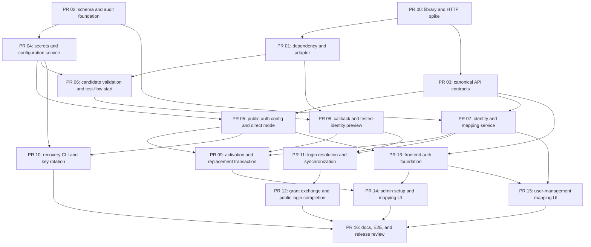

# OAuth/OIDC Authentication Implementation Plan

## Status

- **Purpose:** dependency-ordered execution plan for the approved OAuth/OIDC specification
- **Normative source:** [OAuth/OIDC Authentication Implementation Specification](OAUTH_OIDC_IMPLEMENTATION_SPEC.md)
- **Target:** one standards-compliant OpenID Connect provider in the first release
- **Repository baseline:** Sambee `0.9.0`
- **Implementation state:** planning only; no application code is changed by this document

This plan translates the normative specification into readiness gates and reviewable implementation issues. If this plan and the specification conflict, the specification wins. Update the specification and record approval before implementing a behavior that differs from it.

## Delivery Principles

- Preserve current `password` and deployment-level `none` behavior until an administrator completes tested OIDC activation.
- Keep every intermediate pull request deployable with OIDC dormant or unavailable.
- Keep protocol, outbound HTTP, configuration, identity, and API concerns behind typed boundaries.
- Use the same Sambee JWT and authorization path after either password or OIDC authentication.
- Make migrations idempotent and rehearse them against a copy of a current database before activation code ships.
- Keep secrets, protocol material, provider tokens, raw claims, and raw OIDC subjects out of APIs, URLs, logs, audit rows, and diagnostics.
- Make account mapping and provider replacement transactional. Never expose a detached or partially replaced state.
- Use canonical backend request and response models as the source for frontend types and contract tests.
- Add focused tests in the same pull request as each behavior. Do not defer security-negative tests to final hardening.
- Follow the pinned and hashed backend dependency workflow before changing requirement or lock files.

## Scope And Non-goals

This plan covers the complete first-release OIDC feature described by the specification: provider configuration, validated OIDC networking, interactive testing, login, admission, provisioning, role synchronization, administrator-owned mapping, recovery, frontend workflows, audit persistence, documentation, and release validation.

It does not add generic OAuth 2.0, multiple active providers, self-service account linking, SAML, LDAP, SCIM, background group synchronization, RP-initiated logout, public OIDC clients, private-key JWT authentication, local passwords for OIDC-provisioned users, or a replacement for Sambee JWTs. It does not extend the legacy `AuthMethod` enum with OIDC values; database-owned `sign_in_mode` becomes authoritative only after an authentication configuration row exists.

## Current Repository Anchors

### Backend

- `backend/app/core/auth_methods.py` owns only bootstrap `none` and `password` modes and should remain limited to those values.
- `backend/app/core/config.py` and `backend/app/core/environment.py` are the existing deployment configuration boundaries.
- `backend/app/core/security.py` owns password hashing and Sambee JWT behavior.
- `backend/app/api/auth.py` owns the current public auth config and password token endpoints.
- `backend/app/api/admin.py` is the existing administrator API surface; focused OIDC routers may be introduced instead of enlarging it.
- `backend/app/models/user.py` currently requires `password_hash` and contains reusable profile validators, roles, activity, expiry, and `token_version`.
- `backend/app/db/migrations.py` is the explicit, ordered, idempotent migration runner.
- `backend/app/main.py` registers routers and startup behavior.
- No database-backed audit-event model, reusable validated OIDC HTTP adapter, or packaged `sambee` CLI entry point currently exists.
- `backend/requirements.txt` includes PyJWT and cryptography but no complete OIDC client implementation.

### Frontend

- `frontend/src/services/authConfig.ts` owns the public auth configuration cache and currently falls back to password mode when the request fails.
- `frontend/src/services/api.ts` and neighboring service modules provide the existing API-client patterns.
- `frontend/src/pages/Login.tsx` owns password login and deployment-level `none` behavior.
- `frontend/src/App.tsx` owns route registration.
- `frontend/src/pages/UserManagementSettings.tsx` owns user-management presentation.
- `frontend/src/components/Settings/settingsNavigation.ts` owns settings navigation and capability visibility.
- `frontend/src/i18n/resources.ts` owns user-visible translated strings.

### Validation And Documentation

- `scripts/refresh-backend-lockfiles` is the required lockfile refresh path.
- `scripts/test` is the repository-wide validation entry point.
- End-user documentation belongs under `website/content/docs/` and must follow the docs inheritance and docs-editor workflow.

## Readiness Gates

The gates below are implementation prerequisites, not new product decisions. A gate is complete only when its listed artifact and checks are reviewed. Work explicitly identified as independent may proceed in parallel, but no dependent production behavior may merge first.

### Gate R1: OIDC library and validated HTTP adapter proof

**Owner:** backend/security

**Required before:** public authorization, callback, token exchange, UserInfo, or production provider validation.

Build a focused spike comparing current Authlib and PyJWT/PyJWKClient behavior against the specification. Authlib is the preferred starting point, but selection must be evidence-based. Prove that all library network access can be routed through a Sambee-owned `ValidatedOidcHttpClient`; reject a library path that performs hidden discovery, JWKS, token, or UserInfo requests.

The spike must prove or document the Sambee wrapper for:

- discovery and exact issuer validation
- authorization URL construction with PKCE S256, state, and nonce
- confidential-client code exchange through the validated transport
- ID-token signature, issuer, audience, `azp`, time, nonce, algorithm, and subject validation
- one forced JWKS refresh for an unknown key ID
- normalized typed claims without leaking library token dictionaries
- deterministic mocked-transport tests with no public IdP dependency

**Artifact:** a short decision record in the implementation pull request describing the selected library, version, extension points, rejected alternative, and any Sambee-owned validation retained around it.

**Exit check:** the adapter test fails if the library attempts an unapproved network call.

### Gate R2: quantitative protocol and network constants

**Owner:** backend/security

**Required before:** Gate R1 production adapter merges.

Define named constants in the adapter, with tests at every boundary. Initial values should be reviewed during the spike rather than hidden in client defaults:

| Control | Proposed initial value |
| --- | --- |
| Connect timeout | 3 seconds |
| Read timeout | 5 seconds |
| Discovery response limit | 1 MiB |
| JWKS response limit | 1 MiB |
| Token response limit | 256 KiB |
| UserInfo response limit | 256 KiB |
| Concurrent OIDC outbound requests per process | 4 |
| Discovery/JWKS cache maximum age | 1 hour, further bounded by valid HTTP cache directives |
| ID-token clock skew | 60 seconds |
| Maximum future `iat` tolerance | 60 seconds |
| Pre-callback flow lifetime | 5 minutes |
| Validated test-flow lifetime | 30 minutes |
| Login-grant lifetime | 60 seconds |
| OIDC Sambee JWT lifetime | 60 minutes |

The implementation issue may revise a proposed value with security-review approval and a corresponding specification update when behavior changes. Redirect count remains zero. UserInfo retries remain zero. JWKS gets only the one unknown-key refresh required by the specification.

**Exit check:** tests cover timeout, exact-size acceptance, one-byte-over rejection, concurrency, redirect, cache-age, and clock-skew boundaries.

### Gate R3: canonical API and error models

**Owner:** backend with frontend review

**Required before:** backend and frontend API implementation proceed independently.

Create canonical Pydantic models and enums for:

- public auth configuration and the three sign-in modes
- redacted administrator configuration
- candidate configuration and validation checks
- test-start success
- typed test-flow preview request and response
- tested identity presentation
- mapping-plan rows, prefill sources, target states, and omission acknowledgements
- provider finalization request and completion receipt
- direct Password-only transition request and response
- pending mapping batch requests and row-keyed errors
- move, change, detach, and cancellation operations
- one-time grant exchange and existing login response reuse
- stable public and administrator error codes

Generate and snapshot the relevant OpenAPI component schemas. Frontend types may be generated from or manually mirrored against that reviewed snapshot, but contract tests must detect drift.

**Exit check:** secret fields, issuer, subject, subject hash, provider payloads, and raw claims are absent from every response model where the specification forbids them.

### Gate R4: transactional audit persistence

**Owner:** backend/security

**Required before:** configuration, mapping, provisioning, or role-sync mutations merge.

Add a database-backed audit record rather than relying on application logs. The model must support the stable event names in the specification, UTC timestamp, acting user when known, affected local user when safe and applicable, provider configuration ID, request correlation ID, result/failure category, and a strict typed safe-details object or allowlisted JSON schema.

Audit writes that describe a committed mutation must occur in the same database transaction as that mutation. Failed operations may write a separate redacted failure event after rollback. Audit insertion failure must fail and roll back a security-sensitive mutation rather than silently losing the record.

Define retention and administrator visibility before exposing an audit UI. An audit UI is not required for OIDC v1; durable database records and an operator-supported retrieval path are required.

**Exit check:** tests prove mutation rollback on audit-write failure and prove that forbidden values cannot enter serialized audit details.

### Gate R5: emergency CLI delivery contract

**Owner:** backend/operations

**Required before:** OIDC-only activation is available.

Choose and document one supported invocation that works in the production container. Preferred contract: a packaged console entry point named `sambee`, implemented by a focused module such as `backend/app/cli.py`, yielding:

```text
sambee auth set-mode password-only [--force]
sambee auth rotate-oidc-secret-key
```

If repository packaging cannot reliably install a console script, use an explicitly supported module invocation and provide a container wrapper; do not document an accidental `python -c` command. Both commands must reuse application services and transaction logic rather than duplicate database mutations.

**Exit check:** container-level tests invoke the documented command, cover confirmation and stale-count rechecks, and prove that no command accepts or prints encryption keys.

### Gate R6: migration rehearsal

**Owner:** backend/data

**Required before:** enabling OIDC modes.

Rehearse the migration against:

- a fresh database
- a copy of a current database with users and system settings
- a database where all existing users have passwords
- rollback from an intentionally failed table rebuild
- backup and restore after migration

Verify row counts, password-hash preservation, indexes, foreign keys, singleton and uniqueness constraints, non-null revision defaults, and idempotent reruns.

**Exit check:** migration tests retain a fixture representing the oldest supported upgrade state.

### Gate R7: target provider confirmation

**Owner:** backend, documentation, and release reviewer

**Required before:** feature-complete release approval.

Select the supported Authelia version, confirm its issuer/discovery behavior, `RS256` support, client authentication, PKCE, group claim shape, UserInfo behavior, and uniqueness properties of the documented username claim. Record version-dependent syntax for the final example.

**Exit check:** the version-pinned example passes an automated or controlled end-to-end setup rehearsal.

## Dependency Graph



PR numbers describe dependency order, not necessarily merge order. Parallel work is described below.

## Pull Request Plan

### PR 00: OIDC library and HTTP adapter spike

**Goal:** close Gates R1 and R2 before production protocol code depends on a library.

**Primary files:**

- `backend/requirements-dev.txt` if an isolated spike dependency is needed
- new focused tests under `backend/tests/`
- pull-request decision record; do not add a second normative design document

**Work:**

- Compare current Authlib with PyJWT/PyJWKClient against every Gate R1 operation.
- Prototype transport injection, approved-address connection pinning, original-host TLS verification, bounded response streaming, no redirects, and cache integration.
- Confirm `RS256`; record what is required before adding `ES256`.
- Confirm errors can be converted into safe internal categories without retaining response bodies or token dictionaries.
- Finalize the Gate R2 constants.

**Tests:** deterministic fake DNS and HTTP transport tests for hidden network access, redirect rejection, DNS rebinding, forbidden addresses, TLS host behavior, response limits, timeout limits, unknown-key refresh, algorithms, issuer, audience, `azp`, nonce, and time claims.

**Acceptance:** selected library and adapter architecture are approved; no production route or behavior is enabled.

**Non-goals:** migrations, provider persistence, UI, real-user provisioning, and public IdP tests.

### PR 01: dependency and validated OIDC client foundation

**Depends on:** PR 00.

**Goal:** add the selected pinned dependency and the production typed client boundary.

**Primary files:**

- `backend/requirements.txt`
- `backend/requirements.lock.txt`
- `backend/requirements-dev.lock.txt` when required by the workflow
- new `backend/app/services/oidc_http.py`
- new `backend/app/services/oidc_client.py`
- focused tests under `backend/tests/services/`

**Work:**

- Follow the documented dependency-update workflow and use `scripts/refresh-backend-lockfiles`.
- Implement `ValidatedOidcHttpClient` with the approved DNS, destination, TLS, redirect, timeout, size, JSON, concurrency, and cache rules.
- Implement typed operations for metadata validation, authorization URL construction, callback exchange/validation, optional one-shot UserInfo, and normalized claims.
- Keep library response dictionaries and provider tokens inside the service call.
- Add cache invalidation hooks but do not yet register public routes.

**Security invariants:** all OIDC network traffic uses the adapter; algorithms are allowlisted; redirects are disabled; resolved addresses are pinned for connection; secrets and bodies are redacted.

**Acceptance:** focused tests and backend type checking pass; dependency files are reproducibly generated; no active auth behavior changes.

### PR 02: schema, nullable passwords, and audit foundation

**Goal:** add dormant storage and close the data-model part of Gates R4 and R6.

**Primary files:**

- new `backend/app/models/oidc.py`
- new `backend/app/models/audit.py`
- `backend/app/models/user.py`
- `backend/app/models/__init__.py` if model import registration requires it
- `backend/app/db/migrations.py`
- new migration and model tests under `backend/tests/`

**Work:**

- Add the singleton provider configuration, immutable identity, pending mapping, and flow tables exactly as specified.
- Add audit persistence with allowlisted safe details.
- Rebuild or alter `User` safely so `password_hash` is nullable.
- Add all database checks, unique constraints, indexes, foreign keys, revision defaults, and explicit delete behavior.
- Add a reusable audit writer that participates in a caller-owned transaction.
- Do not seed a provider row or infer mappings for existing users.

**Security invariants:** no plaintext client secret, verifier, nonce, tested identity, or candidate configuration column; immutable identity uniqueness is database-enforced; audit data rejects raw subjects and arbitrary dictionaries.

**Tests:** fresh migration, upgrade fixture, idempotent rerun, failed-rebuild rollback, password preservation, singleton race/constraint, mapping constraints, cascade transaction behavior, and audit-write rollback.

**Acceptance:** old databases retain identical password behavior; a database without a provider row behaves exactly as before.

### PR 03: canonical backend API contracts

**Can run with:** PR 02 after PR 00 establishes library-facing shapes.

**Goal:** close Gate R3 and unblock independent frontend work.

**Primary files:**

- new `backend/app/models/oidc_api.py` or API models colocated in `backend/app/models/oidc.py`
- new contract tests under `backend/tests/api/`
- a checked contract fixture under the existing test-fixture convention

**Work:**

- Define strict enums, bounded strings and arrays, request models, redacted response models, stable error codes, mapping-plan discriminated states, and completion receipts.
- Reuse the existing password login response for successful grant exchange.
- Define omitted-account acknowledgements as row-bound structured values, not a single unscoped boolean.
- Define candidate secret semantics so absence preserves an existing secret and no read model can contain it.
- Snapshot relevant OpenAPI schemas for frontend drift tests.

**Acceptance:** Gate R3 exit checks pass and frontend reviewers approve field names, nullability, and error handling.

### PR 04: environment, encryption, and configuration service

**Depends on:** PR 02 and PR 03.

**Goal:** implement external-key handling and transactional configuration logic without OIDC activation.

**Primary files:**

- `backend/app/core/config.py`
- `backend/app/core/environment.py`
- new `backend/app/services/oidc_configuration.py`
- `backend/app/main.py` for startup health initialization only
- focused tests under `backend/tests/core/` and `backend/tests/services/`

**Work:**

- Load and validate `SAMBEE_OIDC_SECRET_KEY` and `SAMBEE_PUBLIC_URL` explicitly.
- Derive the fixed callback URI only from the trusted public URL.
- Add Fernet encryption/redaction helpers for client secrets and encrypted flow payloads.
- Add typed candidate normalization, secret-preserve/replace behavior, group normalization, mapping collision checks, revision calculation, and cache invalidation hooks.
- Expose authentication health without logging key material.
- Fail OIDC closed when ciphertext cannot be decrypted; preserve configured recovery behavior and stored ciphertext.

**Security invariants:** no automatic OIDC key generation; no database fallback key; decrypted values have request-local lifetime; exceptions and model representations redact values.

**Acceptance:** missing or bad keys cannot enable OIDC, while provider-free password and `none` deployments continue normally.

### PR 05: public auth config and direct Password-only mode

**Depends on:** PR 03 and PR 04.

**Goal:** introduce canonical sign-in-mode reads and the guarded direct transition without enabling OIDC login.

**Primary files:**

- `backend/app/api/auth.py`
- new `backend/app/api/admin_auth.py`
- `backend/app/main.py`
- `backend/app/core/security.py`
- focused API tests under `backend/tests/api/`

**Work:**

- Return canonical `sign_in_mode` from `GET /api/auth/config`, preserving legacy behavior when no database row exists.
- Add the administrator redacted configuration read.
- Add `PUT /api/admin/auth/mode`, limited to Password-only with expected configuration revision, expected active/unexpired passwordless count, and required acknowledgement.
- Recompute counts and local-password administrator availability in the write transaction.
- Increment every existing user token version only after a valid transition.
- Make password login, change, and reset fail safely and generically when no hash exists.
- Add the legacy TOML deprecation warning only after a database configuration exists.

**Security invariants:** the endpoint cannot enable OIDC; it preserves provider configuration and mappings; the UI path has no force option; absent hashes do not produce timing-sensitive or internal errors.

**Acceptance:** all existing auth regression tests pass; stable stale-count, stale-revision, and no-local-administrator errors have no side effects.

### PR 06: provider validation and test-flow start

**Depends on:** PR 01, PR 03, and PR 04.

**Goal:** implement non-destructive **Connect and test** initiation.

**Primary files:**

- `backend/app/services/oidc_configuration.py`
- `backend/app/services/oidc_client.py`
- new `backend/app/services/oidc_flow.py`
- `backend/app/api/admin_auth.py`
- focused service and API tests

**Work:**

- Add `POST /api/admin/auth/oidc/test-login`.
- Validate local fields, metadata, JWKS, endpoint safety, advertised capabilities, and warnings.
- Encrypt and persist the candidate, state verifier material, initiating administrator, active configuration existence/revision, and immutable server-derived intent.
- Return only the safe validation report or a server-generated authorization URL with `Cache-Control: no-store`.
- Add opportunistic expired-flow cleanup.

**Security invariants:** active configuration is untouched; authorization URLs never come from client input; each attempt creates a fresh immutable flow; flow material is encrypted or hashed as specified.

**Acceptance:** abandoned and failed candidates leave active login unchanged; a successful response contains no secret or provider document.

### PR 07: identity, admission, roles, and mapping service

**Depends on:** PR 02 and PR 03.

**Goal:** build the transaction services used by login, activation, and administrator mapping APIs.

**Primary files:**

- new `backend/app/services/oidc_identity.py`
- new `backend/app/services/oidc_mapping.py` if separation improves clarity
- `backend/app/models/user.py`
- focused tests under `backend/tests/services/`

**Work:**

- Implement immutable `(issuer, subject)` lookup and exact pending-username consumption order.
- Implement admission, Unicode group normalization, cross-role collision rejection, precedence, and fixed viewer fallback.
- Implement provisioning and existing-user profile/role synchronization using current `User` validators.
- Implement last-administrator role-sync protection and token-version changes.
- Implement atomic pending batch create/replace/cancel/consume, mapping move/change/detach, revision increments, affected-user session invalidation, and transactional audit events.
- Implement stateless mapping-plan derivation from current users and mappings.

**Security invariants:** admission precedes mapping consumption; usernames never resolve established identities; identity moves require a known internal identity ID and never a raw subject; every mapping mutation increments the mapping revision once per transaction.

**Acceptance:** concurrency tests prove one provisioning or consumption result; every partial-write and audit failure rolls back.

### PR 08: callback validation and tested-identity preview

**Depends on:** PR 01 and PR 06; uses PR 07 for policy evaluation.

**Goal:** finish purpose-`test` callback processing without changing active authorization.

**Primary files:**

- new `backend/app/api/oidc_auth.py`
- `backend/app/api/admin_auth.py`
- `backend/app/services/oidc_flow.py`
- `backend/app/services/oidc_client.py`
- `backend/app/main.py`
- focused callback and preview tests

**Work:**

- Claim exactly one unexpired `started` flow before provider exchange.
- Validate callback, code exchange, token, nonce, required claims, and at most one UserInfo request.
- Clear verifier and nonce ciphertext through an exactly-one-row conditional update before purpose-specific completion.
- Store only the encrypted typed tested-identity snapshot, set 30-minute expiry, and redirect with only the flow UUID fragment.
- Add the setup-only allowlisted missing-groups fragment failure.
- Add the authenticated stateless body-bearing preview and test-flow deletion endpoints.
- Delete terminal callback failures conditionally from `callback_processing` and retain only a separate redacted failure audit event.

**Security invariants:** no provisioning, mapping, role mutation, or Sambee JWT for test purpose; no issuer or subject in preview; zero-row transitions make no later provider request or mutation.

**Acceptance:** race, replay, expiry, cancellation, redaction, UserInfo reason, and ciphertext-deletion tests pass.

### PR 09: provider activation and identity-namespace replacement

**Depends on:** PR 05, PR 07, and PR 08.

**Goal:** implement the sole provider finalization endpoint and atomic reviewed activation/replacement.

**Primary files:**

- `backend/app/api/admin_auth.py`
- `backend/app/services/oidc_configuration.py`
- `backend/app/services/oidc_identity.py`
- `backend/app/services/oidc_flow.py`
- focused integration tests

**Work:**

- Add `PUT /api/admin/auth/oidc` without an operation field.
- Recheck flow ownership/status/expiry, configuration existence/revision, mapping revision, every row, omission acknowledgements, uniqueness attestation, administrator state, tested identity admission/role, unique administrator mapping, and resulting usable administrator.
- For initial activation, promote the candidate, map the tested administrator, and create reviewed pending rows in one transaction.
- For replacement intent, replace established and pending mappings from the complete reviewed plan, invalidate affected sessions, and increment both revisions in one transaction.
- Add direct allowed updates in recovery mode with scoped invalidation and fresh-test enforcement for OIDC-only policy changes.
- Clear encrypted payloads and retain only the short-lived completion receipt.
- Make same-administrator retry of a finalized flow return the receipt without another mutation or audit event.

**Security invariants:** no delete-before-replace state; request cannot override flow intent; stale reviews have no effects; failed writes leave the unexpired flow correctable.

**Acceptance:** transaction-failure injection, concurrency, stale-plan, stale-config, lost-response retry, and administrator-lockout tests pass.

### PR 10: emergency mode and encryption-key rotation CLI

**Depends on:** PR 04 and PR 05. Must close Gate R5 before OIDC-only UI ships.

**Goal:** provide supported server-side recovery and maintenance commands.

**Primary files:**

- `backend/pyproject.toml` when using a console entry point
- new `backend/app/cli.py` and focused command modules as needed
- existing container/build files only when required to install the command
- CLI and container invocation tests

**Work:**

- Implement `sambee auth set-mode password-only` using the same transition service as the API.
- Report usable local-password administrators and active/unexpired passwordless accounts; recheck both after confirmation.
- Refuse lockout by default and allow only an explicitly warned `--force` containment path.
- Implement stopped-application OIDC encryption-key rotation using environment variables only.
- Re-encrypt and verify the client secret, delete all ephemeral flows, and commit both changes atomically.
- Print exact deployment next steps without printing keys.

**Security invariants:** no password reset or bypass; no key command-line arguments; no duplicated direct SQL mutation path; no multiple live keys.

**Acceptance:** documented production-container invocation passes tests, including rollback and stale-count paths.

### PR 11: login identity resolution, provisioning, and synchronization

**Depends on:** PR 07 and PR 08.

**Goal:** complete purpose-`login` callback behavior up to creation of the one-time grant.

**Primary files:**

- `backend/app/api/oidc_auth.py`
- `backend/app/services/oidc_identity.py`
- `backend/app/services/oidc_flow.py`
- integration tests with the deterministic fake provider

**Work:**

- Apply admission, immutable identity lookup, pending mapping consumption, or atomic provisioning in the specified order.
- Reject collisions, inactive users, expired users, missing required claims, malformed groups, and policy failures with stable errors.
- Synchronize valid profile fields and role; apply the last-administrator guard.
- Generate a random login grant, store only its hash and revocation snapshot, set the 60-second deadline, transition to `callback_validated`, and redirect with the fragment.
- Add all required audit events without claim or subject leakage.

**Security invariants:** callback URL contains only the one-time grant fragment; no Sambee JWT is issued in callback; concurrent callbacks cannot create duplicate users or identities.

**Acceptance:** admission, mapping, provisioning, role, profile, concurrency, and failure-path integration tests pass.

### PR 12: grant exchange and public login completion

**Depends on:** PR 11.

**Goal:** issue the existing Sambee JWT only after atomic one-time grant exchange.

**Primary files:**

- `backend/app/api/oidc_auth.py`
- `backend/app/services/oidc_flow.py`
- `backend/app/core/security.py`
- focused API and integration tests

**Work:**

- Add `GET /api/auth/oidc/authorize`, complete `GET /api/auth/oidc/callback`, and add `POST /api/auth/oidc/exchange`.
- Sanitize `return_to` to application-owned relative routes.
- Atomically consume a valid grant and recheck user activity, expiry, token version, and configuration revision.
- Issue a 60-minute OIDC-authenticated Sambee JWT through the existing token path.
- Add `Referrer-Policy: no-referrer` and safe cache headers to callback responses.
- Document deployment-layer rate-limit endpoints and add application hooks where existing infrastructure supports them.

**Acceptance:** grant replay/expiry, stale configuration, return-path, password lifetime, WebSocket, and companion-dependent session regression tests pass.

### PR 13: frontend authentication foundation

**Depends on:** PR 03 contract and PR 05 public config.

**Goal:** adopt canonical auth configuration and add login/callback routing without the administrator wizard.

**Primary files:**

- `frontend/src/services/authConfig.ts`
- new `frontend/src/services/oidcAuthApi.ts`
- `frontend/src/services/api.ts` when shared token completion belongs there
- `frontend/src/pages/Login.tsx`
- new `frontend/src/pages/OidcCallback.tsx`
- `frontend/src/App.tsx`
- `frontend/src/i18n/resources.ts`
- existing auth tests and new focused tests

**Work:**

- Replace `auth_method` with canonical `sign_in_mode` and derive method availability.
- Replace fetch-failure fallback-to-password with an authentication-unavailable retry state. Never infer that local login is enabled after a failed config read.
- Add `/login/local` and `/login/oidc/callback` with correct mode gates.
- Parse and remove the callback fragment before exchange; load no third-party resources on the callback page.
- Centralize successful-token storage, tracing initialization, current-user load, and safe return navigation for password and OIDC.
- Implement one automatic OIDC-only reauthentication attempt and loop suppression in `sessionStorage`.
- Map only stable server errors and safe allowlisted fragment errors to translated messages.

**Acceptance:** all four effective states (`none`, Password-only, recovery, OIDC-only), outage behavior, callback replay prevention, logout suppression, deep return routes, and accessibility tests pass.

### PR 14: administrator authentication setup and replacement UI

**Depends on:** PR 09, PR 10, and PR 13.

**Goal:** deliver the six-step administrator workflow and direct Password-only action.

**Primary files:**

- new `frontend/src/pages/AuthenticationSettings.tsx`
- new focused components under `frontend/src/components/Settings/Authentication/`
- new `frontend/src/services/oidcAdminApi.ts`
- `frontend/src/components/Settings/settingsNavigation.ts`
- `frontend/src/App.tsx`
- `frontend/src/i18n/resources.ts`
- focused page, component, and integration tests

**Work:**

- Implement Prerequisites, Provider, Connect and test, Access policy and roles, Review existing accounts, and Activate.
- Keep provider fields separate from post-test policy choices; hide standard scopes/claims under Advanced.
- Schema-check the server authorization URL and navigate unchanged with top-level `window.location.assign`.
- Keep the flow UUID only in setup-tab `sessionStorage`; remove safe error fragments immediately.
- Use body-bearing preview for every policy/mapping-plan reevaluation and never cache it.
- Implement shared initial/replacement mapping review, inline row errors, omission acknowledgements, stale-plan replacement, uniqueness attestation, and inactive-account presentation.
- Retry an ambiguous finalization with the same flow ID before permitting a new test.
- Add explicit cancel through the deletion endpoint.
- Add direct Password-only confirmation with displayed count, stale refresh, local-administrator block, and no force control.
- Clear auth-config cache after committed settings changes.

**Acceptance:** frontend tests cover every wizard state, secret semantics, URL validation, fresh-test boundaries, stale reviews, timeout retry, focus/error behavior, and capability gating.

### PR 15: user-management authentication and mapping UI

**Depends on:** PR 07 APIs and PR 13 frontend contracts. May merge after PR 14 if shared components are first introduced there.

**Goal:** expose administrator-owned mapping operations and authentication status in existing user management.

**Primary files:**

- `frontend/src/pages/UserManagementSettings.tsx`
- shared mapping components under `frontend/src/components/Settings/Authentication/`
- `frontend/src/services/oidcAdminApi.ts`
- `frontend/src/i18n/resources.ts`
- focused user-management tests

**Work:**

- Show Local password, OIDC, or both, provider display name, last OIDC login, and pending state without subject data.
- Add individual and batch pending mappings through one request contract.
- Add normal **Change OIDC account** and Advanced move/detach actions with required warnings.
- Hide password actions for accounts without a hash and in OIDC-only mode.
- Explain mapping-versus-admission and detach-versus-revoke behavior.
- Refresh affected user, mapping revision, and auth configuration after mutations.

**Acceptance:** no self-service control exists; raw identity IDs are used only internally where required and raw subjects are never displayed or accepted; all confirmation and rollback states are tested.

### PR 16: documentation, E2E, operations, and release review

**Depends on:** PR 10, PR 12, PR 14, and PR 15. Gate R7 closes here.

**Goal:** complete operator guidance, cross-layer validation, and security release approval.

**Primary files:**

- earliest applicable pages under `website/content/docs/`
- version-pinned Authelia example and configuration assets
- frontend E2E tests under `frontend/e2e/`
- backend deterministic provider fixtures under `backend/tests/`
- deployment examples such as `config.example.toml` and `docker-compose.example.yml` only where required by the approved docs

**Work:**

- Use the docs editor and inheritance workflow for every website-doc change.
- Document setup, callback URL, claims, admission, roles, mappings, replacement, recovery, secret rotation, key rotation, stable errors, privacy, upgrade behavior, and logout limitations.
- Add the complete supported Authelia example and validate it against the selected version.
- Run the full specification E2E matrix, migration rehearsal, dependency checks, frontend checks, backend tests/type check, repository script, and a focused security review.
- Verify deployment-layer rate-limit examples for authorization, callback, exchange, and password login.

**Acceptance:** all specification acceptance criteria pass; no unresolved high-severity protocol, SSRF, replay, mapping, privilege, lockout, or secret-handling finding remains.

## Parallelization Guidance

After PR 00 resolves the library boundary, the following lanes may proceed concurrently:

| Lane | Work | Constraints |
| --- | --- | --- |
| A | PR 01 validated client | Must close R1/R2; blocks all provider network behavior. |
| B | PR 02 schema/audit | Can proceed independently; coordinate model names with PR 03. |
| C | PR 03 API contracts | Requires backend and frontend joint review before either side branches widely. |
| D | Gate R5 CLI packaging design | May prototype invocation only; production mutations wait for PR 04/05 services. |
| E | Gate R7 Authelia research | May confirm version and claim behavior early; final docs wait for implemented behavior. |

After PR 03 merges, frontend PR 13 may start against mocked canonical schemas while backend PRs 04-09 proceed. The administrator wizard can be component-tested against mock handlers after the preview/finalization contract is frozen, but it must not merge with fabricated fields or error semantics.

PR 07 identity services and PR 08 callback/test completion may be developed in parallel only after agreeing on the normalized tested-identity type and transaction ownership. PR 09 owns the finalization transaction and must not duplicate validators from PR 07; it composes them within one caller-owned session.

Public OIDC login must not merge before PR 01 proves all network calls are controlled. OIDC-only UI must not merge before the recovery CLI is verified in the production container. Release documentation must not claim support before the Authelia rehearsal and full security review pass.

## Cross-cutting Contracts

### Transaction ownership

Service functions that participate in activation, replacement, provisioning, mapping, role synchronization, or direct mode changes accept a caller-owned database session and do not commit internally. The outer operation owns commit/rollback and includes its audit write. Read-only validation may use independent sessions where it cannot create a time-of-check/time-of-use assumption.

### Revision ownership

- Configuration service increments `configuration_revision` for the exact changes listed in the specification.
- Mapping service increments `identity_mapping_revision` exactly once per committed transaction containing one or more mapping mutations.
- `token_version` changes happen in the same transaction as authorization-relevant state.
- Flow service snapshots and verifies revisions but never invents replacement intent at finalization time.

### Flow transitions

Every flow mutation uses a conditional update containing ID, expected status, purpose when relevant, ownership when relevant, and unexpired deadline. The caller verifies exactly one affected row before any later provider request or purpose-specific mutation. Keep this primitive centralized in `oidc_flow.py` and test it with independent database sessions.

### Error handling

Domain services raise typed internal errors containing a stable code and safe context only. API layers select the approved HTTP status and public message. Provider/library exceptions are wrapped at the client boundary; raw exception strings never cross into API responses or audit details. Logs include a correlation ID and safe reason category.

### Frontend contract discipline

Frontend code derives available methods solely from `sign_in_mode`. API parsing rejects unknown modes, malformed mapping rows, unsafe authorization URLs, and malformed completion receipts. A failed public auth-config request renders authentication unavailable with retry; it never enables a login method by assumption.

### Dormant rollout

Schema, services, and routes may ship before UI only when no provider row exists by default and no OIDC mode can become active without the complete tested finalization guard. Feature incompleteness must fail closed and must not reinterpret legacy TOML values.

## Validation Strategy

### Per-pull-request minimum

- Run the narrow unit/integration tests for the touched behavior immediately after the first substantive edit.
- Run backend mypy for backend model/service/API changes.
- Run frontend type check and lint for frontend changes.
- Run migration tests for every schema change.
- Run contract drift tests for every API-model change.
- Run `git diff --check` before review.

### Milestone suites

| Milestone | Required validation |
| --- | --- |
| After PR 02 | Fresh/upgrade/idempotency migration suite and complete password/`none` regressions. |
| After PR 06 | Validated HTTP negative suite and candidate-flow persistence/redaction tests. |
| After PR 09 | Activation, replacement, stale review, audit rollback, revision, and idempotent retry integration suites. |
| After PR 12 | Full backend auth suite using deterministic fake provider, including WebSocket and companion-dependent session behavior. |
| After PR 15 | Full frontend unit/integration suite and all auth/settings accessibility checks. |
| Before release | Backend tests and mypy, frontend tests/type/lint, E2E matrix, migration rehearsal, repository-wide `scripts/test`, docs validation, Authelia rehearsal, and security review. |

Tests must not call a public IdP. The final supported-provider rehearsal may use a controlled local/containerized Authelia instance.

## Documentation Impact By Issue

| Issue | Documentation impact |
| --- | --- |
| PR 00-01 | Developer note for selected dependency and transport boundary; no end-user claims. |
| PR 02 | Upgrade note draft for nullable passwords and new tables; publish only with feature release. |
| PR 04 | Deployment variables, key generation, backup, trust-store, and health behavior. |
| PR 05 | Database-owned mode precedence and Password-only transition semantics. |
| PR 06-09 | Setup, test, mapping-plan, activation, replacement, errors, and audit behavior. |
| PR 10 | Emergency mode and stopped-application encryption-key rotation runbooks. |
| PR 11-12 | Login, recovery, session lifetime, provisioning, admission, role synchronization, and logout. |
| PR 14-15 | Field-level UI reference and administrator mapping workflows. |
| PR 16 | Consolidation, Authelia example, troubleshooting, security/privacy, and release notes. |

Website documentation is intentionally delivered near feature completion so it describes verified behavior, but each implementation PR must note its documentation impact and PR 16 may not omit it.

## Requirement Traceability

The matrix maps normative specification sections to the implementation issue that owns behavior and the issue that proves integration. A section may have additional unit coverage in prerequisite issues.

| Specification requirement | Primary implementation | Integration/release proof |
| --- | --- | --- |
| Goals, non-goals, legacy JWT consequence | PR 03, PR 05, PR 12 | PR 16 |
| Administrator six-step setup UX | PR 14 | PR 16 |
| Login modes and `/login/local` | PR 05, PR 13 | PR 16 |
| User-management authentication state | PR 15 | PR 16 |
| Authorization start, state, nonce, PKCE | PR 01, PR 06, PR 12 | PR 16 |
| Callback claim and token validation | PR 01, PR 08, PR 11 | PR 16 |
| One-shot UserInfo and diagnostic reasons | PR 01, PR 08 | PR 16 |
| Exactly-one-row flow transitions | PR 06, PR 08, PR 12 | PR 16 |
| Login grant and 60-second exchange | PR 11, PR 12, PR 13 | PR 16 |
| Test snapshot, preview, cancel, and expiry | PR 06, PR 08, PR 14 | PR 16 |
| Idempotent finalization receipt | PR 09, PR 14 | PR 16 |
| Immutable identity resolution | PR 02, PR 07, PR 11 | PR 16 |
| Pending username mapping | PR 07, PR 09, PR 15 | PR 16 |
| Initial and replacement mapping plans | PR 07, PR 09, PR 14 | PR 16 |
| Admission and auto-provisioning | PR 07, PR 11 | PR 16 |
| Profile and role synchronization | PR 07, PR 11 | PR 16 |
| Last-administrator role guard | PR 07, PR 11 | PR 16 |
| Group normalization and precedence | PR 07 | PR 14, PR 16 |
| Provider singleton and revision model | PR 02, PR 04 | PR 09, PR 16 |
| External encryption key and rotation | PR 04, PR 10 | PR 16 |
| Nullable user passwords | PR 02, PR 05 | PR 13, PR 16 |
| Bootstrap/configuration precedence | PR 04, PR 05 | PR 16 |
| Session invalidation scope | PR 05, PR 07, PR 09 | PR 16 |
| Public authentication API | PR 03, PR 05, PR 12 | PR 13, PR 16 |
| Administrator API | PR 03, PR 05-09 | PR 14-16 |
| Stable error registry | PR 03, PR 05, PR 08-12 | PR 13-16 |
| Validated outbound HTTP and SSRF controls | PR 00, PR 01 | PR 16 security review |
| OIDC dependency/library requirement | PR 00, PR 01 | PR 16 dependency validation |
| Protocol security requirements | PR 01, PR 06, PR 08, PR 12 | PR 16 security review |
| Application/browser security requirements | PR 02-15 | PR 16 security review |
| Durable logging and audit events | PR 02, PR 05-12 | PR 16 audit review |
| Frontend types, routes, and accessibility | PR 13-15 | PR 16 |
| Database migration and dormant rollout | PR 02, PR 04-05 | PR 16 migration rehearsal |
| Rollback and emergency recovery | PR 05, PR 10 | PR 16 operations rehearsal |
| Administrator documentation | PR 16 | PR 16 docs validation |
| Version-pinned Authelia example | Gate R7, PR 16 | PR 16 provider rehearsal |
| All 20 resolved decisions | PR 00-16 according to rows above | PR 16 specification checklist |

## Release Checklist

- [ ] Gates R1-R7 are closed with linked evidence.
- [ ] All canonical API schemas and stable errors match frontend parsing and tests.
- [ ] No active behavior changes when no provider configuration exists.
- [ ] Password, `none`, recovery, and OIDC-only suites pass.
- [ ] Migration rehearsal and backup/restore pass on a current database copy.
- [ ] Secrets and protocol material are absent from API, URL, log, audit, and database plaintext checks.
- [ ] Flow replay, race, expiry, and exactly-one-row transition tests pass.
- [ ] Activation and replacement rollback, stale-review, and idempotent-retry tests pass.
- [ ] Last-administrator and Password-only recovery paths are tested in UI and CLI.
- [ ] The documented CLI runs in the production container.
- [ ] The version-pinned Authelia setup works from the published instructions.
- [ ] Backend tests and mypy pass.
- [ ] Frontend tests, type check, and lint pass.
- [ ] End-to-end and repository-wide checks pass.
- [ ] Documentation validation and derived-artifact refresh pass.
- [ ] Focused security review has no unresolved high-severity finding.

## Definition Of Done

The implementation is complete only when an administrator can configure the supported Authelia version from the documentation, test and safely activate either OIDC mode, migrate or replace account mappings atomically, recover through the documented password-only command when credentials permit, and sign in through a protocol flow that passes the complete negative security test matrix. Existing password and `none` deployments must remain behaviorally compatible, and no implementation step may weaken the specification's identity, replay, SSRF, privilege, lockout, audit, or secret-handling invariants.
